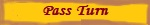

# Dungeon Quest
Welcome to the repository for Dungeon Quest, a grid-based dungeon crawler game created using Pygame in Python. In this game, you navigate through various levels of a dungeon, fighting off enemies, searching for loot, and trying to complete your quest.

## Table of Contents
- [Features](#features)
- [How to play](#how-to-play)
- [Movement](#movement)
- [Enemies](#enemies)
- [Customization](#customization)
- [Installation](#installation)
- [File Structure](#file-structure)
- [Contributing](#contributing)
- [Author](#author)
- [Huge Thanks](#huge-thanks)
- [License](#license)

## Features
Dynamic Gameplay: Move through the dungeon, engage in combat with enemies, and search for treasures.
Customizable Levels: The game is designed to allow for easy adaptation and expansion. New levels can be added to keep the game exciting.
Various Characters: Start with a barbarian character, but the game is designed to allow adding new player characters, such as the rogue, with assets already included in the assets folder.
Interactive UI: Utilize buttons like move, attack, search, and more to interact with the game world.

## How to Play
The game is controlled using both the keyboard for movement and mouse clicks for interactions such as attacking, searching, and using items.

## Movement
Use the arrow keys to move your character around the grid.
Actions
Move Button: Click to enter the movement phase, then use arrow keys.

Attack Button: Click to enter the attack phase, then click on an adjacent enemy to attack.

Search Button: Click to search an adjacent crate, table, chest, or barrel.

Potion Button: Click to use a potion to replenish your health to the maximum health (8).

Pass Button: Click to end turn and commence enemy turn.

## Enemies
Encounter various enemies like skeletons, goblins, chaos warriors, and even a dragon. Each enemy type has its unique behavior and attack strategy.

## Customization
Feel free to adapt the game according to your preferences. You can add a title screen, more levels, or introduce new player characters. The game's flexible design encourages creativity and expansion.

## Installation
To run Dungeon Quest, you'll need Python and Pygame installed on your system.

Clone the repository or download the source code.
Ensure you have Python installed. If not, download and install it from python.org.
Install Pygame by running pip install pygame in your terminal or command prompt.
Navigate to the game's directory and run python dungeon_quest.py to start the game.

## File Structure
The DD.py file runs the game. The game_maps.py has the tile map information used by the DD.py file to choose the correct tiles for the level. Please feel free to add more levels in this file. The assets folder contains the images and audio files in seperate folders.

## Contributing
Contributions to Dungeon Quest are welcome! Whether it's adding new features, creating new levels, or improving the code, feel free to fork the repository and submit a pull request.

## Author
Alex McKinley

## Huge Thanks
I must give a huge thanks to the hard workers who made the Hero Quest game and Space Crusade game on Amiga. Playing these games as a child brought me so much joy, fostered my imagination, and still inspire me to this day.

## License
Dungeon Quest is open-source and is available under the MIT License. Feel free to use, modify, and distribute the game as you see fit.

Enjoy exploring the dungeons and embarking on quests in Dungeon Quest!
